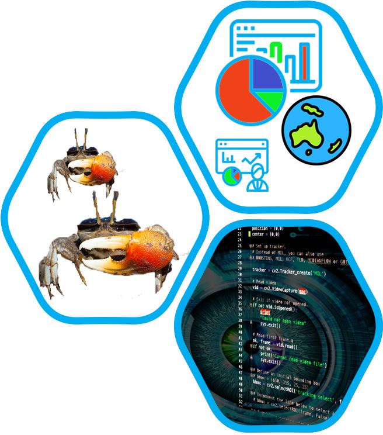
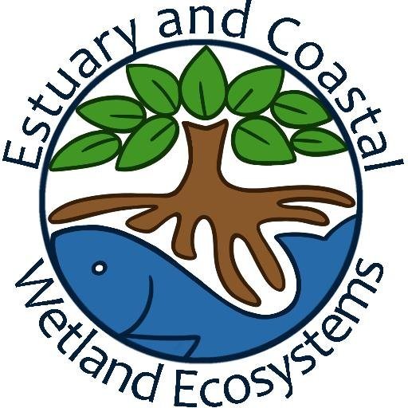
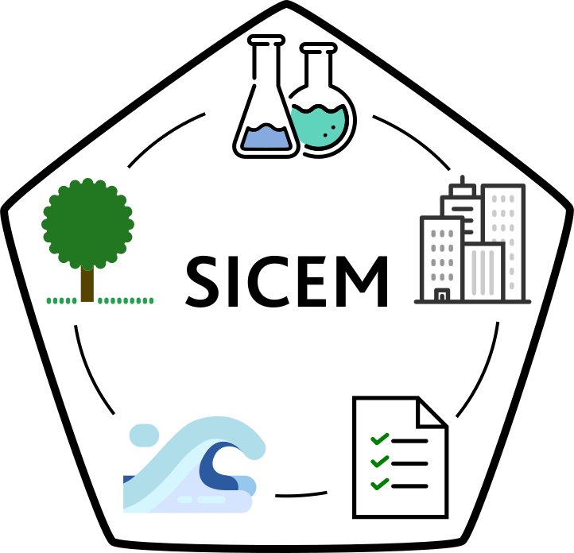
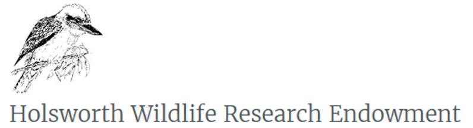
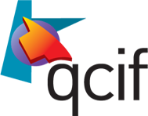
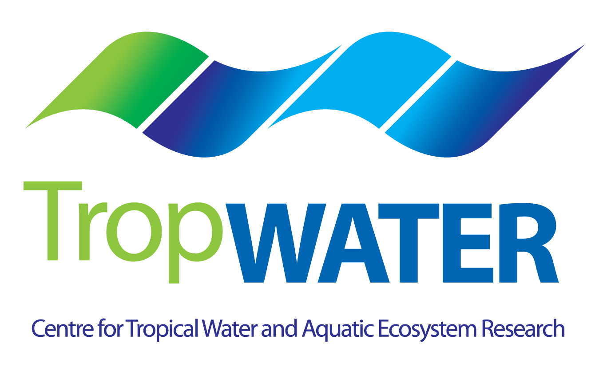

[](https://www.gnu.org/licenses/gpl-3.0)
[](https://github.com/CexyNature/Crabspy)
[](https://github.com/CexyNature/Crabspy)
[](https://twitter.com/cexynature?lang=en)

 CrabSpy
==========

An heuristic toolbox for spying<sup>*</sup> intertidal crabs in their environment; built in Python. In continuous development.

<sup>*</sup> Furtively collect information about crabs functional biology and ecology: species identity, movement patterns, change in coloration, feeding rates, bioturbation, and more. 


> *"Until comparatively recently, ecologists were content to describe how nature “looks” (sometimes by means of fantastic
 terms!) and to speculate on what she might have looked like in the past or may look like in the future. 
 Now, an equal emphasis is being placed on what nature ‘does’, and rightly so, because the changing face 
 of nature can never be understood unless her metabolism is also studied. This change in approach brings 
 the small organisms into perspective with the large, and encourages the use of experimental methods to 
 supplement the analytic. It is evident that so long as a purely descriptive viewpoint is maintained, 
 there is very little in common between such structurally diverse organisms as sperma-tophytes, 
 vertebrates and bacteria. In real life, however, all these are intimately linked functionally in 
 ecological systems, according to well-defined laws. Thus the only kind of general ecology is that which
 I call a ‘functional ecology’..."*

> -- Eugene P. Odum <br>
> &nbsp;&nbsp;&nbsp; Fundamentals of Ecology, 1957

# Content:

- [Overview](#Overview)
- [Why CrabSpy and similar initiatives are important?](#Why-CrabSpy-and-similar-initiatives-are-important?)
- [Introduction](#Introduction)
- [Requirements](#Requirements)
- [Installation](#Installation)
- [How to collaborate](#How-to-collaborate)
- [Acknowledgement](#Acknowledgement)

## Overview

Crabspy is proposing an alternative workflow to collect biological and ecological data from intertidal crabs using computer vision and learning. Crabspy aims to provide a toolbox which can accelerate and improve information collection, enabling rapid and actionable scientific and policy response by means of a faster data streamline.


## Why CrabSpy and similar initiatives are important?

Traditional methods to collect data on the ecology of crabs and their role within ecosystems are often time consuming, invasive and can alter the natural habitat of the study site. The development of new technologies therefore presents an ideal opportunity to innovate and improve on traditional techniques to scale up data collection to the levels required.
Furthermore, many species are disappearing before we can even catalogue them or describe them. Thus, natural scientists are faced with challenge of needing to rapidly increase their efforts to gather reliable species and ecosystem information at broader spatial and temporal scales. Crabspy seeks to ease some of these challenges by incorporating automation on data collection.

## Introduction


## Requirements

- python >= 3.5

- joblib==0.13.2

- matplotlib==2.2.0

- numpy==1.14.2

- opencv-contrib-python==3.4.2.16

- opencv-python==3.4.2.16

- pandas==0.23.4

- pylint==2.4.4

- pytest==5.3.2

- pytest-cov==2.8.1

- PyWavelets==1.0.3

- scikit-image==0.15.0

- scikit-learn==0.21.3

- scipy==1.0.0

## Installation

1. Create virtual environment
2. Clone or Download project
3. Navigate inside project
4. Run

```
python setup.py
```

## Code in Progress (yet not working as expected)

- correct_hc.py
- fast_track.py
- draw_track.py
- manual_tracking.py
- scoop_feed.py
- scoop_feed_v1.py
- snaps_dict.py
- svm_hog.py
- test.py


## How to collaborate

We would like to see this code used by other researchers, professionals and nature enthusiasts. Please do not hesitate to share your friendly feedback, create issues, suggest features, and create pull requests. We are also keen in receiving bugs reports and fiddler crab images.

*Information about submitting pull request can be found in this [article](https://code.tutsplus.com/tutorials/how-to-collaborate-on-github--net-34267).*


## Acknowledgement

Organizations which made possible this project by funding or allocating other sources (computing, expertise) to C. Herrera

<a href="https://www.jcu.edu.au/">
    
</a>

<a href="https://research.jcu.edu.au/portfolio/marcus.sheaves/">
    
</a>

<a href="https://www.jcu.edu.au/sicem">
    
</a>
<br>
<a href="https://www.ecolsoc.org.au/awards-and-prizes/holsworth-wildlife-research-endowment">
    
</a>

<a href="https://www.ecolsoc.org.au/awards-and-prizes/holsworth-wildlife-research-endowment">
    
</a>
<br>
<a href="https://nectar.org.au/">
    
</a>

<a href="https://www.qcif.edu.au/">
    
</a>

<a href="https://www.qriscloud.org.au/">
    
</a>
<br>
<a href="https://www.mdatatechjcu.com/">
    
</a>

<a href="https://www.tropwater.com/"> 
    
</a>
<br>
[ASPP-APAC 2019](https://scipy-school.org/)
<br>

<!-- Created by Cesar Herrera -->
[![alt text][1.2]][1]
[![alt text][2.2]][2]
<!-- icons without padding -->
[1.2]: images/logos/twittericon2.png (icon without padding)
[2.2]: images/logos/githubicon2.png (github icon without padding)
<!-- links to accounts -->
[1]: http://www.twitter.com/CexyNature
[2]: http://www.github.com/CexyNature
<!-- End -->