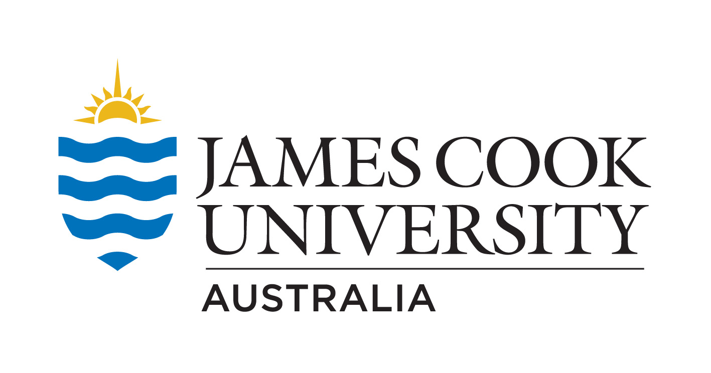
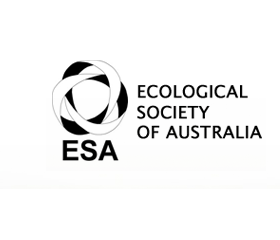

<!-- Created by Cesar Herrera -->
[![alt text][1.2]][1]
[![alt text][2.2]][2]
<!-- icons without padding -->
[1.2]: images/logos/twittericon2.png (icon without padding)
[2.2]: images/logos/githubicon2.png (github icon without padding)
<!-- links to accounts -->
[1]: http://www.twitter.com/CexyNature
[2]: http://www.github.com/CexyNature
<!-- End -->

 CrabSpy
==========

An heuristic toolbox for spying<sup>*</sup> intertidal crabs in their environment; built in Python. In continuous development.

<sup>*</sup> Furtively collect information about crabs functional biology and ecology: species identity, movement patterns, change in coloration, feeding rates, bioturbation, and more. 


> *"Until comparatively recently, ecologists were content to describe how nature “looks” (sometimes by means of fantastic
 terms!) and to speculate on what she might have looked like in the past or may look like in the future. 
 Now, an equal emphasis is being placed on what nature ‘does’, and rightly so, because the changing face 
 of nature can never be understood unless her metabolism is also studied. This change in approach brings 
 the small organisms into perspective with the large, and encourages the use of experimental methods to 
 supplement the analytic. It is evident that so long as a purely descriptive viewpoint is maintained, 
 there is very little in common between such structurally diverse organisms as sperma-tophytes, 
 vertebrates and bacteria. In real life, however, all these are intimately linked functionally in 
 ecological systems, according to well-defined laws. Thus the only kind of general ecology is that which
 I call a ‘functional ecology’..."*

> -- Eugene P. Odum <br>
> &nbsp;&nbsp;&nbsp; Fundamentals of Ecology, 1957

# Content:

- [General description](#General-description)
- [Why CrabSpy and similar initiatives are important?](#Why-CrabSpy-and-similar-initiatives-are-important?)
- [How to use](#How-to-use)
- [Requirements](#Requirements)
- [Installation](#Installation)
- [How to collaborate](#How-to-collaborate)
- [Acknowledgement](#Acknowledgement)

## General description

CrabSpy 


## Why CrabSpy and similar initiatives are important?

Describe traditional sampling methods, and the need to collect and analyze biodiversity data faster.

## How to use


## Requirements

- python >= 3.5

- opencv >= 3.3.0

- numpy >= 1.14.2


## Installation

Fork or clone. Set virtual environment. Type:
```
python run.py
```

## Code in Progress (yet not working as expected)

- correct_hc.py
- fast_track.py
- draw_track.py
- manual_tracking.py
- scoop_feed.py
- scoop_feed_v1.py
- snaps_dict.py
- svm_hog.py
- test.py


## How to collaborate

Add features, work in features, fix bugs, provide crab images.

*Information about submitting pull request can be found in this [article](https://code.tutsplus.com/tutorials/how-to-collaborate-on-github--net-34267).*


## Acknowledgement

Funding and other sources allocated to C. Herrera which made possible this project







