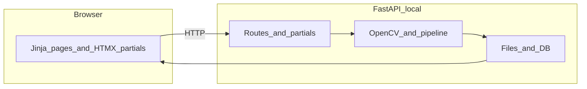
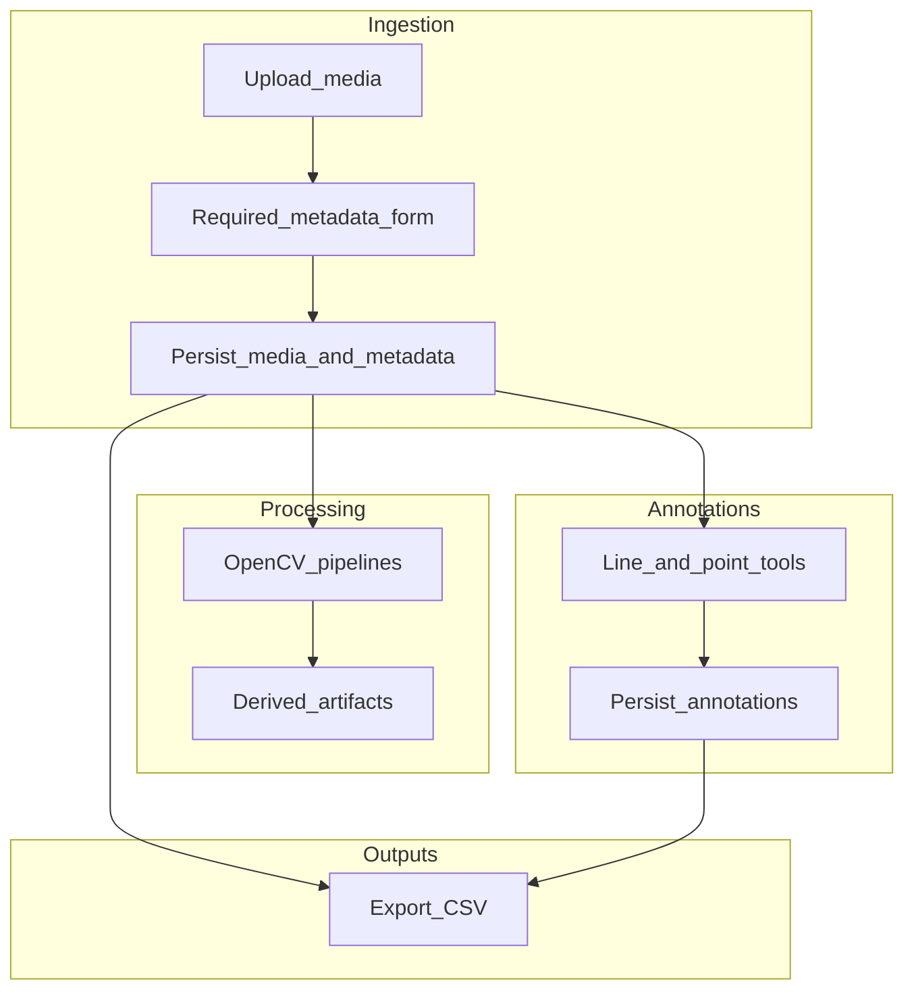

# Crabspy rebuild plan

## Decided software stack

| Layer | Choice | Notes |
| ----- | ------ | ----- |
| Core / CV | **Python** + **OpenCV** (and existing scientific stack) | All heavy processing stays on the server. |
| HTTP API + HTML | **FastAPI** | Local app; use `Jinja2Templates` for full pages and fragments. |
| Frontend interactivity | **HTMX** + **Jinja2** | Partial templates, `hx-get` / `hx-post`, minimal custom JavaScript. |
| Deployment target | **Local** (e.g. `uvicorn` on localhost) | Simplifies auth/TLS for v1; document boundaries if you later expose the service. |
| Container orchestration | **Docker** + **Docker Compose** | One-command environment for developers and users; matches CI where useful. |

OpenCV’s **Python** bindings do not run in the browser. The UI handles uploads, parameters, progress, and **display** of images and video (e.g. `<video>`, thumbnails, SVG/canvas overlays for tracks and ROIs). Client-side CV (OpenCV.js, WebCodecs) is out of scope unless a future requirement appears.

## Media, metadata, annotations, and database

**Media** means **images and videos** (and, later, derived products such as frames or exports) that Crabspy ingests and processes.

### Required metadata (before processing)

Before any **processing** step (OpenCV pipelines, tracking, etc.), the workflow must **record and persist** essential **study metadata** alongside **technical file information**. Minimum fields:

| Field | Purpose |
| ----- | ------- |
| **Date media collected** | When the recording or image was captured (store as explicit date/time with timezone policy documented). |
| **Sample code** | Identifier linking the media to a sample or specimen context. |
| **Site name** | Field or sampling site label. |
| **Location name** | Finer-grained place label (beach plot, quadrat, station, etc.). |
| **Notes** | Free text for protocol, conditions, or caveats. |

**Technical file information** stored with the same logical **media** record should include at least: **storage path** (or object key), **original filename**, **MIME type** or format, **dimensions** (images), **duration and frame rate** where available (video), and optional **checksum** for integrity. Enforce the rule in UI and API: **no processing job starts** until the media row exists with required metadata satisfied (or define an explicit “draft upload” state that cannot enter pipelines).

### Annotations

Users must be able to create **annotations on media**:

- **Line measurements**: polylines or line segments with enough geometry to reproduce lengths in pixel space (and later scale if a calibration model exists).
- **Reference points**: point markers (e.g. landmarks or calibration anchors).

For **video**, each annotation must be tied to a **frame index** or **timestamp** so it is reproducible. Prefer **normalized coordinates** (0–1 relative to width/height) plus stored image dimensions at annotation time to reduce pain on resize, unless the project standard is raw pixels—**pick one convention and document it**.

Store annotations in **normalized relational tables** (e.g. `annotation`, `annotation_point` with ordering) or structured **JSON** columns with a strict schema validated in Python; relational form often simplifies CSV flattening.

### Database and CSV export

- Use a **relational database** with a migration tool (**Alembic** or equivalent) so schema changes are reviewable. Default for local science workflows: **SQLite** (single file per project, easy backup). Keep the door open to **PostgreSQL** or others via a **database URL** if deployments grow.
- **CSV export**: provide one or more export actions (CLI and/or web) that write **`.csv`** files—for example, one export for **media + metadata**, and optional exports for **annotations** (flattened rows per point or per segment with media id and frame/time). Use stable column headers and UTF-8 encoding.
- **Testing**: cover export round-trips on small fixtures (create row → export → compare).

### Switching databases between projects

Crabspy must support **changing the active database** when working across **different projects** (different studies or field campaigns).

- **Mechanism**: maintain an **active connection** (or session factory) keyed to a **configurable database URL** or **path to a `.sqlite` file**. Expose **“Open project / database”** in the UI and a matching CLI flag or env var for headless use.
- **Isolation**: each database should own or reference its **media root** (where files live) consistently; document whether **absolute paths** or **roots relative to a project folder** are stored so moving disks does not break links.
- **Concurrency**: for local use, a **single-writer** SQLite assumption is usually enough; document limits if multiple processes open the same file.
- **Docker**: mount a **volume** for **database files** and **media** so switching projects maps cleanly to “different files on the host” or “different compose override paths.”

## Separate “library” from “app” early

Today the repo is largely **scripts and modules** under [`crabspy/`](../crabspy/). For maintainability and for other users:

- Treat **`crabspy` as an installable library** with a small, documented public API (functions/classes for track, extract, measure, etc.).
- Put the **web app** in a dedicated package or directory (e.g. `crabspy_web/` or `apps/web`) that **imports** the library instead of duplicating logic.
- Keep a **CLI** (`typer` / `click`) for batch or headless use alongside the local web UI.

## Backend (FastAPI + OpenCV)

- Use FastAPI for routes, file uploads, and optional **streaming** responses (video ranges, previews).
- **Long-running work** (full-video processing): avoid blocking a single request indefinitely. For a **local** app, start with **FastAPI `BackgroundTasks`**, a **thread/process pool**, or a **lightweight queue** (e.g. ARQ/RQ) if you need progress and cancellation; add **polling endpoints** or **SSE** for HTMX-friendly updates.
- **Artifacts**: define job-scoped directories for **uploads**, **intermediate frames**, and **exports** so paths stay predictable and safe; align directory layout with the **active project database** and CSV export paths.

## Frontend (HTMX + Jinja2)

- **Full pages** extend a base Jinja layout; **fragments** are small templates returned for `hx-get` / `hx-post` (lists, status blocks, form errors).
- Prefer **progressive enhancement**: forms work without JS where possible; HTMX enhances submission and partial refresh.
- For **images and video**: support sensible upload limits, lazy-loaded thumbnails, and HTML5 video for previews.
- For **metadata**: step-first flows (e.g. upload → **metadata form** → unlock processing) using HTMX form posts and validation partials.
- For **annotations**: interactive line and point placement typically needs a **small amount of client-side code** (canvas or SVG + pointer events) even with HTMX; use HTMX to **save** annotation payloads to the server and to refresh side panels (measurement lists, status). Keep annotation JSON/schema shared between server validation and any minimal JS.

## Testing strategy

Automated tests are part of day-to-day development—not an afterthought—so refactors and new pipelines stay safe.

- **Unit tests** (`pytest`): pure Python and OpenCV logic with **small, committed fixtures** (tiny images/clips or synthetic arrays) so CI stays fast and deterministic. Avoid depending on multi-gigabyte sample videos in the default suite; gate heavy assets behind optional markers (e.g. `@pytest.mark.slow` or `@pytest.mark.integration_local`).
- **HTTP / app tests**: use FastAPI’s **`TestClient`** (or **httpx** against the ASGI app) to assert status codes, redirects, and **HTML fragments** returned for HTMX endpoints (e.g. key snippets or `HX-Redirect` headers where used).
- **Boundaries**: prefer testing **library functions** directly; keep route handlers thin so most behavior is covered without spinning up full browser automation. Add **optional** end-to-end checks later (e.g. Playwright) only if a flow is hard to cover otherwise.
- **CI**: run the default test job on every push/PR; document how to run the full suite locally and inside Docker (see below).

## Docker and Docker Compose

**Docker Compose** is the standard way to run the project for contributors and users who want a repeatable environment without manual Python/FFmpeg/OpenCV setup on the host.

- **Jinja + HTMX note**: the “frontend” is **server-rendered by FastAPI** (templates + static files). In Compose, that is usually **one primary service** (e.g. `web`) running **uvicorn** (or **gunicorn** + uvicorn workers). You do not need a separate Node build for the UI unless you add one later.
- **Compose layout**: define a **`Dockerfile`** for the application image (Python deps, system packages such as FFmpeg if required), a **`docker-compose.yml`** with **port mapping** (e.g. `8000:8000`), and **named volumes** for **uploads**, **job output**, **project SQLite files or DB data**, and optional **cache** so data survives container restarts.
- **Extensibility**: reserve space in Compose for **additional services** as the architecture grows (e.g. a **worker** for background jobs, **Redis**, or a database) without rewriting the basic `web` service contract.
- **Tests**: optionally add a **Compose profile** or target that runs **`pytest`** in the same image used for the app, so “works in Docker” stays aligned with local installs.

## Operational notes (local-first)

- **Packaging**: Prefer **`pyproject.toml`** and a documented **Python minimum** (e.g. 3.10+) aligned with current OpenCV wheels; optional lockfile for reproducible installs. Treat **Docker Compose** as the documented “happy path” for running the full app stack alongside **native** `uvicorn` for quick iteration.
- **System dependencies**: Document **FFmpeg** (and optional **GPU**) where pipelines need them.
- **Resource limits**: Even locally, cap upload size and consider timeouts so one bad file does not hang the process.
- **Security**: Validate uploads (type/size), sanitize filenames, avoid path traversal. For strict localhost use, auth is optional at first; document risks if the bind address is opened beyond `127.0.0.1`.

## License ([GPL v3](https://www.gnu.org/licenses/gpl-3.0))

GPL affects **distribution** of the combined work. Server-rendered Jinja templates are still part of the same program as the FastAPI app; confirm your policy if you later split a thin client or relicense a library boundary.

## Migration strategy

1. **Phase 1**: Stabilize core algorithms behind functions; add **pytest** coverage with small fixtures and wire **CI** to run the default suite.
2. **Phase 2**: **Data layer vertical slice**: schema and migrations; **register media** with **required metadata**; **switch active database**; **CSV export** of media rows; tests for these paths.
3. **Phase 3**: **Annotation** capture (lines, reference points) on image and video frames, persisted to the DB, with export included or linked in CSV workflows.
   - **Phase 3b (in progress)**: relational `annotation` / `annotation_point`, video point UI, `POST /media/{id}/annotations`, CSV backup via `GET /media/export_annotations.csv`, and optional **full backup** by copying the SQLite file when the app is stopped. Next: polyline drawing (multi-click + finish) and image viewer using the same API.
4. **Phase 4**: One **processing** vertical slice (e.g. upload video → one OpenCV pipeline step) only after metadata is recorded; HTMX for job status.
5. **Phase 5**: Generalize jobs, storage, and UI patterns before porting every legacy script.

## Summary

The stack is **fixed**: **FastAPI + Jinja2 + HTMX** for a **local** tool, with **Python/OpenCV** on the server, **pytest** for quality, and **Docker Compose** for a consistent run path. Domain priorities include **media (images/videos)** with **mandatory metadata** before processing, **annotations** (line measurements, reference points) stored in a **relational database**, **CSV export**, and **runtime switching** between project databases. Next work spans **library API clarity**, **schema and migrations**, **metadata and annotation UX**, **job + file layout**, **tests + CI**, and **container definitions**.
