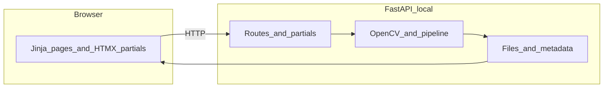

# Crabspy rebuild plan

## Decided software stack

| Layer | Choice | Notes |
| ----- | ------ | ----- |
| Core / CV | **Python** + **OpenCV** (and existing scientific stack) | All heavy processing stays on the server. |
| HTTP API + HTML | **FastAPI** | Local app; use `Jinja2Templates` for full pages and fragments. |
| Frontend interactivity | **HTMX** + **Jinja2** | Partial templates, `hx-get` / `hx-post`, minimal custom JavaScript. |
| Deployment target | **Local** (e.g. `uvicorn` on localhost) | Simplifies auth/TLS for v1; document boundaries if you later expose the service. |
| Container orchestration | **Docker** + **Docker Compose** | One-command environment for developers and users; matches CI where useful. |

OpenCV’s **Python** bindings do not run in the browser. The UI handles uploads, parameters, progress, and **display** of images and video (e.g. `<video>`, thumbnails, SVG/canvas overlays for tracks and ROIs). Client-side CV (OpenCV.js, WebCodecs) is out of scope unless a future requirement appears.

## Separate “library” from “app” early

Today the repo is largely **scripts and modules** under [`crabspy/`](../crabspy/). For maintainability and for other users:

- Treat **`crabspy` as an installable library** with a small, documented public API (functions/classes for track, extract, measure, etc.).
- Put the **web app** in a dedicated package or directory (e.g. `crabspy_web/` or `apps/web`) that **imports** the library instead of duplicating logic.
- Keep a **CLI** (`typer` / `click`) for batch or headless use alongside the local web UI.

## Backend (FastAPI + OpenCV)

- Use FastAPI for routes, file uploads, and optional **streaming** responses (video ranges, previews).
- **Long-running work** (full-video processing): avoid blocking a single request indefinitely. For a **local** app, start with **FastAPI `BackgroundTasks`**, a **thread/process pool**, or a **lightweight queue** (e.g. ARQ/RQ) if you need progress and cancellation; add **polling endpoints** or **SSE** for HTMX-friendly updates.
- **Artifacts**: define job-scoped directories for **uploads**, **intermediate frames**, and **exports** so paths stay predictable and safe.

## Frontend (HTMX + Jinja2)

- **Full pages** extend a base Jinja layout; **fragments** are small templates returned for `hx-get` / `hx-post` (lists, status blocks, form errors).
- Prefer **progressive enhancement**: forms work without JS where possible; HTMX enhances submission and partial refresh.
- For **images and video**: support sensible upload limits, lazy-loaded thumbnails, and HTML5 video for previews; overlays (tracks, ROIs) can be SVG or canvas fed by JSON from small API routes if needed.

## Testing strategy

Automated tests are part of day-to-day development—not an afterthought—so refactors and new pipelines stay safe.

- **Unit tests** (`pytest`): pure Python and OpenCV logic with **small, committed fixtures** (tiny images/clips or synthetic arrays) so CI stays fast and deterministic. Avoid depending on multi-gigabyte sample videos in the default suite; gate heavy assets behind optional markers (e.g. `@pytest.mark.slow` or `@pytest.mark.integration_local`).
- **HTTP / app tests**: use FastAPI’s **`TestClient`** (or **httpx** against the ASGI app) to assert status codes, redirects, and **HTML fragments** returned for HTMX endpoints (e.g. key snippets or `HX-Redirect` headers where used).
- **Boundaries**: prefer testing **library functions** directly; keep route handlers thin so most behavior is covered without spinning up full browser automation. Add **optional** end-to-end checks later (e.g. Playwright) only if a flow is hard to cover otherwise.
- **CI**: run the default test job on every push/PR; document how to run the full suite locally and inside Docker (see below).

## Docker and Docker Compose

**Docker Compose** is the standard way to run the project for contributors and users who want a repeatable environment without manual Python/FFmpeg/OpenCV setup on the host.

- **Jinja + HTMX note**: the “frontend” is **server-rendered by FastAPI** (templates + static files). In Compose, that is usually **one primary service** (e.g. `web`) running **uvicorn** (or **gunicorn** + uvicorn workers). You do not need a separate Node build for the UI unless you add one later.
- **Compose layout**: define a **`Dockerfile`** for the application image (Python deps, system packages such as FFmpeg if required), a **`docker-compose.yml`** with **port mapping** (e.g. `8000:8000`), and **named volumes** for **uploads**, **job output**, and optional **cache** so data survives container restarts.
- **Extensibility**: reserve space in Compose for **additional services** as the architecture grows (e.g. a **worker** for background jobs, **Redis**, or a database) without rewriting the basic `web` service contract.
- **Tests**: optionally add a **Compose profile** or target that runs **`pytest`** in the same image used for the app, so “works in Docker” stays aligned with local installs.

## Operational notes (local-first)

- **Packaging**: Prefer **`pyproject.toml`** and a documented **Python minimum** (e.g. 3.10+) aligned with current OpenCV wheels; optional lockfile for reproducible installs. Treat **Docker Compose** as the documented “happy path” for running the full app stack alongside **native** `uvicorn` for quick iteration.
- **System dependencies**: Document **FFmpeg** (and optional **GPU**) where pipelines need them.
- **Resource limits**: Even locally, cap upload size and consider timeouts so one bad file does not hang the process.
- **Security**: Validate uploads (type/size), sanitize filenames, avoid path traversal. For strict localhost use, auth is optional at first; document risks if the bind address is opened beyond `127.0.0.1`.

## License ([GPL v3](https://www.gnu.org/licenses/gpl-3.0))

GPL affects **distribution** of the combined work. Server-rendered Jinja templates are still part of the same program as the FastAPI app; confirm your policy if you later split a thin client or relicense a library boundary.

## Migration strategy

1. **Phase 1**: Stabilize core algorithms behind functions; add **pytest** coverage with small fixtures and wire **CI** to run the default suite.
2. **Phase 2**: One **vertical slice** in the web app (e.g. upload video → one pipeline step) end-to-end with HTMX partials and job status.
3. **Phase 3**: Generalize jobs, storage, and UI patterns before porting every legacy script.

## Summary

The stack is **fixed**: **FastAPI + Jinja2 + HTMX** for a **local** tool, with **Python/OpenCV** on the server, **pytest** for quality, and **Docker Compose** for a consistent run path. Next work is **library API clarity**, **app scaffold**, **HTMX/UI conventions**, **job + file layout**, **tests + CI**, and **container definitions**—not further frontend framework comparison.
